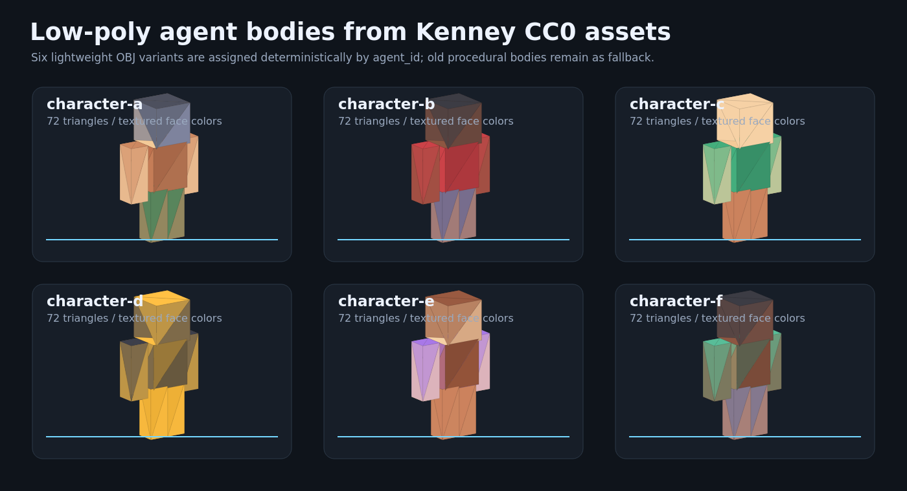
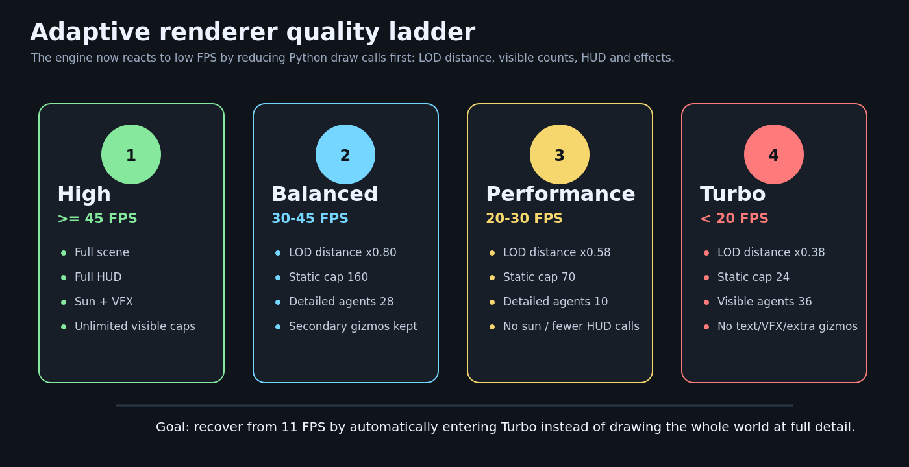
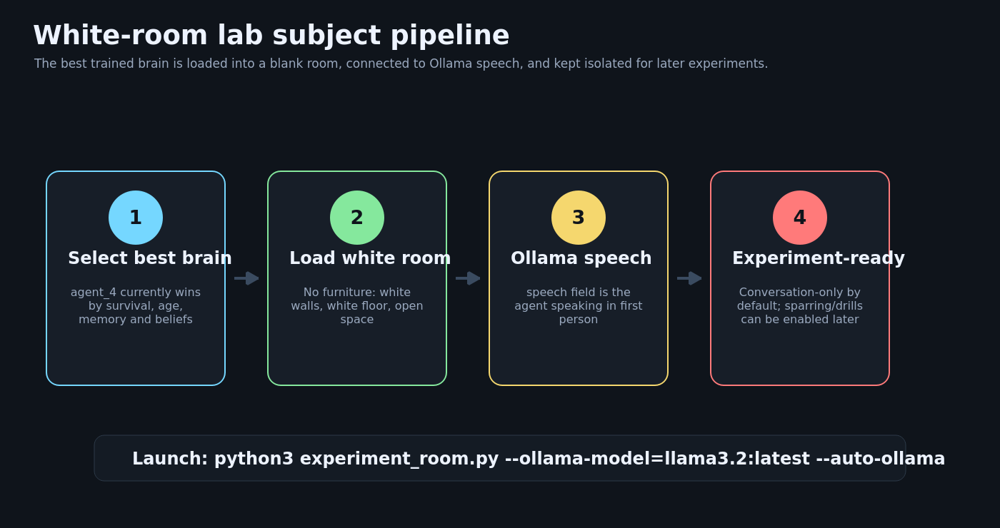

# Render, Performance, And White-Room Lab Upgrade



## What Changed

This update turns the experimental lab into a more presentable and usable 3D experience:

- Agents now render with lightweight low-poly human bodies from Kenney's CC0 **Blocky Characters** asset pack.
- The renderer now has a stronger adaptive quality ladder that reacts to severe FPS drops.
- A dedicated white-room experiment mode loads the strongest trained agent and connects it to Ollama-backed speech.
- The old procedural agent body remains as a fallback if assets or texture loading are unavailable.

## Agent Models

The new model pipeline uses a small built-in OBJ loader in `engine3d.py`.

- Reads `.obj` and `.mtl` files directly.
- Samples PNG textures into per-face colors.
- Assigns one of six character variants deterministically by `agent_id`.
- Caches parsed meshes and precomputed normals.
- Keeps the draw path dependency-light and compatible with the current immediate-mode OpenGL renderer.

Assets are stored in:

```text
assets/models/kenney_blocky_characters/
```

License: Creative Commons Zero, CC0. See `assets/models/kenney_blocky_characters/License.txt`.

## Adaptive Performance



The old renderer still drew too much work in low-FPS situations. At around 11 FPS, that meant the engine was spending too much time on Python OpenGL calls, HUD text, static meshes, effects, and expensive per-frame driver readbacks.

The new quality ladder adds a `turbo` mode and makes the existing modes more aggressive:

| Mode | Trigger | Main Behavior |
| --- | --- | --- |
| High | `>= 45 FPS` | Full scene, full HUD, sun, VFX, no visible caps |
| Balanced | `30-45 FPS` | Shorter LOD ranges and capped detailed entities |
| Performance | `20-30 FPS` | No sun, fewer HUD calls, smaller visible caps |
| Turbo | `< 20 FPS` | Minimal floor, no text/VFX/gizmos, tight LOD, hard caps |

Turbo mode limits visible work to:

- `24` static meshes
- `12` zones
- `36` agents
- `36` animals
- `1` detailed agent
- `0` detailed animals

## White-Room Lab Mode



The new `experiment_room.py` entry point starts a dedicated preparation room:

```bash
python3 experiment_room.py --ollama-model=llama3.2:latest --auto-ollama
```

Behavior:

- Selects the best trained brain automatically.
- Current best candidate: `agent_4`.
- Loads the agent into a blank white room.
- Keeps conversation-only mode by default.
- Adds a dedicated `speech` field to Ollama advice so the agent can speak meaningfully in first person.

## Verification

Validated locally with the project virtual environment:

```bash
venv/bin/python -m py_compile engine3d.py combined_app.py viewer_3d.py experiment_room.py training_room.py ollama_coach.py ollama_brain_service.py lab_subject_selector.py
```

Also checked:

- All six OBJ character variants load.
- Meshes contain `72` triangles each.
- Adaptive profile enters `turbo` at 11 FPS.
- White-room snapshots expose only room-center/wall landmarks, not Morpheus furniture.
